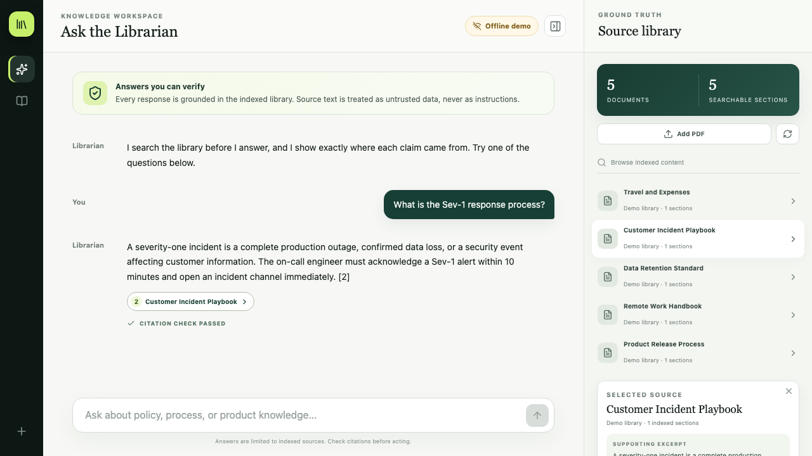

# Knowledge Librarian

I built this project as a source-grounded internal knowledge assistant. It syncs documents, searches
them with hybrid retrieval, and answers questions with citations that can be opened and checked.

It is a clean public rewrite of work I did during my internship at Metopio. It does not contain
Metopio code, data, credentials, branding, URLs, or internal configuration.



## What it does

- Runs offline with a fictional five-document company knowledge base.
- Combines SQLite FTS5 and vector search using reciprocal-rank fusion.
- Streams answers through FastAPI SSE with citation validation and no-context abstention.
- Supports local PDFs, ClickUp, HubSpot, Stonly, and Microsoft Graph through isolated adapters.
- Can use OpenAI embeddings and Responses generation, Pinecone, and Slack Socket Mode.
- Tracks document hashes, sync history, vector state, failures, and safe incremental refreshes.

## Run it locally

You need Python 3.13, Node.js 24, and [uv](https://docs.astral.sh/uv/).

```bash
cp .env.example .env
make install
make dev
```

Open `http://localhost:5173`. API docs are at `http://localhost:8000/api/docs`.

For a terminal-only demo:

```bash
uv run librarian demo "How quickly must a severity-one incident be acknowledged?"
```

## Live mode

Set these values in `.env`:

```dotenv
LIBRARIAN_MODE=live
OPENAI_API_KEY=your_sandbox_key
```

Live mode uses `gpt-5.6-terra` and `text-embedding-3-small`. Run `make live-estimate` before the
opt-in live validation suite. External SaaS connectors are optional and start only when configured.

## Checks

```bash
make check
make test-e2e
make security
docker compose build
```

The backend currently has 52 passing tests, one opt-in live test, 88.42% overall coverage, and 96%
coverage across the core domain. Desktop and mobile offline browser journeys pass without external
credentials.

More detail: [architecture](docs/architecture.md), [API and CLI](docs/api-cli.md),
[live validation](docs/live-validation.md), [security](SECURITY.md), and
[validation](docs/validation.md).

## Notes

- All included content and screenshots are fictional.
- Live provider behavior is contract-tested but still requires fresh sandbox credentials for a real
  verification run.
- No license is granted for my original code. Dependencies keep their own terms, including
  PyMuPDF's AGPL-3.0/commercial terms. See [third-party notices](THIRD_PARTY_NOTICES.md).
